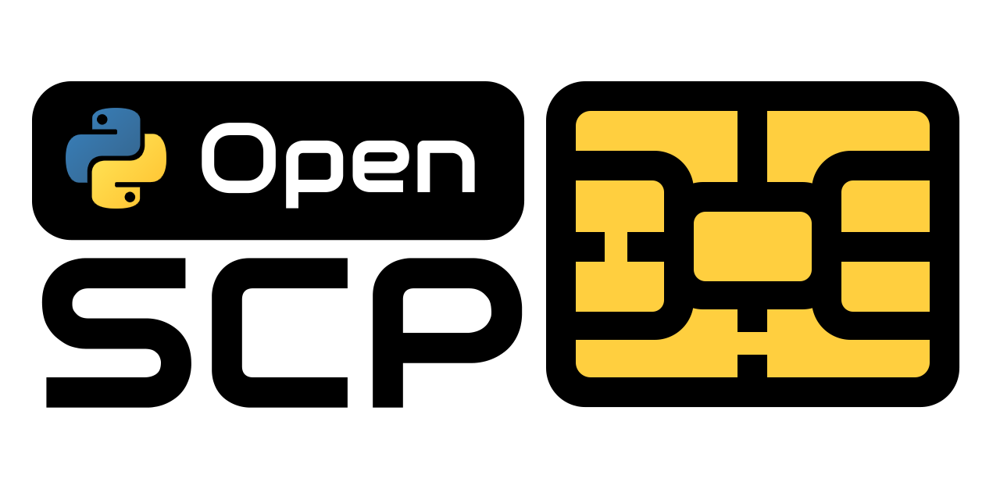

# SCP03 and SCP11 protocols implementation for off-card entity

## Description

The library provides implementation of secure communication between off-card entity (OCE) and Security Domain (SD)
according to GlobalPlatform's (GP) [Secure Channel Protocols](https://globalplatform.org/?s=secure+channel+protocol) SCP03 based on static symmetric keys and SCP11 based on certificates. The solution utilizes [OpenSCP-Java](https://github.com/Samsung/OpenSCP-Java) prebuilt library for core logic and Python modules to build similar user interface 

## Features
- smooth integration to user's Secure Element transport solution as extra security layer
- SCP 03 & 11 sepcificatons support
### Specification compliance
The solution provides feature set according to the specifications:

- [SCP03](https://globalplatform.org/specs-library/secure-channel-protocol-03-amendment-d-v1-2/) up to v1.2
- [SCP11](https://globalplatform.org/specs-library/secure-channel-protocol-11-amendment-f/) up to v1.4

**Please aware** of [known issues](#known-issues) list which explains what features introduced in specifications aren't supported

## Documentation

- [API](docs/html)
- [Environment information](https://github.com/Samsung/OpenSCP-Python/wiki/Environment)
- [Usage example](https://github.com/Samsung/OpenSCP-Python/wiki/Usage-example) 

## Known issues

### SCP03 not implemented features

- Lower security levels support - only maximum security level is supported now (C-DECRYPTION, R-ENCRYPTION, C-MAC, and R-MAC)
- Pseudo-random card challenge verification - verification is optional according to the specification
- BEGIN R-MAC session & END R-MAC session commands - implementation is optional according to the specification

### SCP11 not implemented features

- SD certificate validation
- Usage of CA-KLCC Identifier in GET_DATA (Certificate Store), MUTUAL AUTHENTICATE.
  - For now, only "KID/KVN" is used
  - "CA-KLCC Identifier" and "KID/KVN" usage is mutually exclusive and shall be chosen by OCE
- Usage of Host and Card ID in Key Derivation process
  - For now, it is not used
  - HostID usage is chosen by OCE during MUTUAL AUTHENTICATE / INTERNAL AUTHENTICATE
- Lower security levels support - only maximum security level is supported now (C-DECRYPTION, R-ENCRYPTION, C-MAC, and R-MAC)
  - Key usage is chosen by OCE during MUTUAL AUTHENTICATE / INTERNAL AUTHENTICATE
- Some library exceptions might be not descriptive enough
